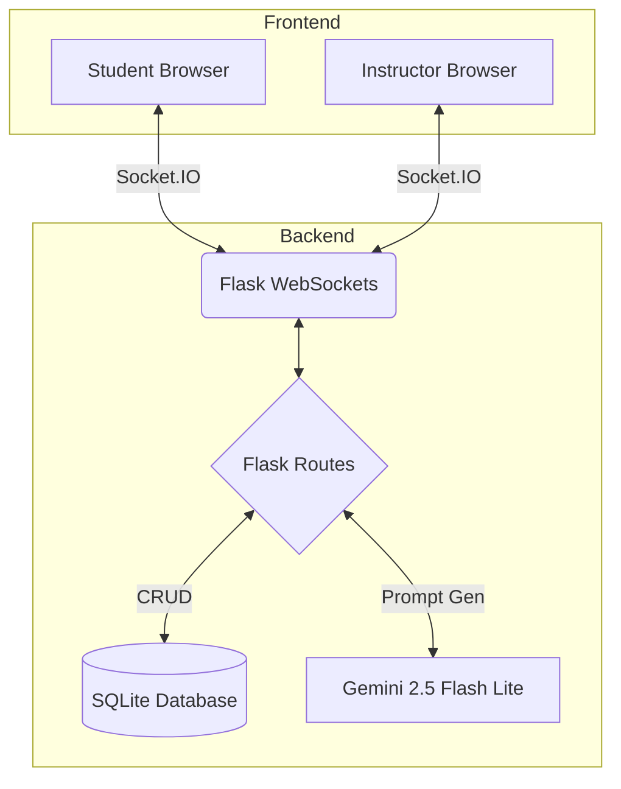
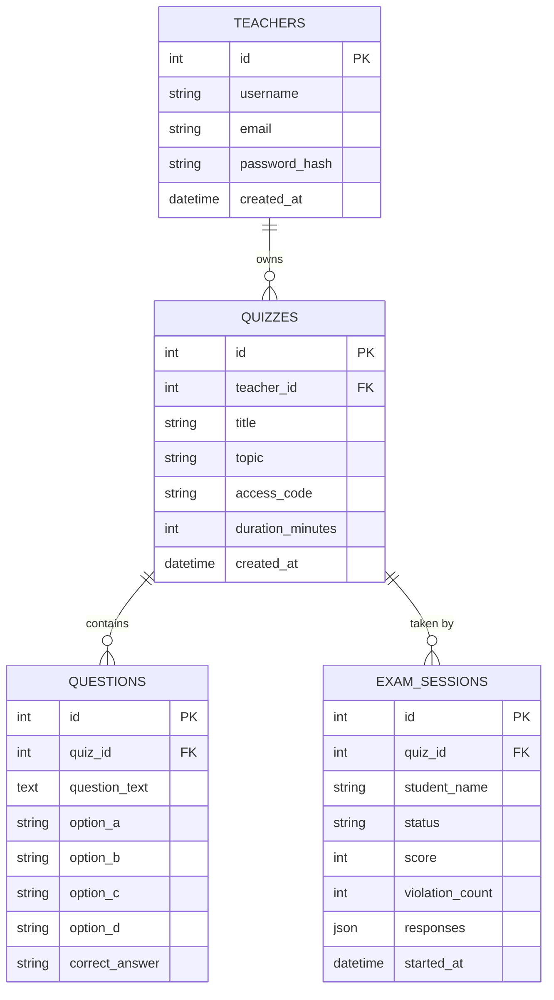

<p align="center">
  <h1 align="center">CLUELY.AI</h1>
  <p align="center">
    <strong>AI-Enhanced, Guardian-Integrated Secure Quiz Platform</strong>
  </p>
  <p align="center">
    A real-time, anti-cheat online examination system built with Flask, Socket.IO, and Google Gemini AI. Features a brand-new <i>Editorial Brutalist</i> design language.
  </p>
  <p align="center">
    <a href="#features">Features</a> •
    <a href="#tech-stack">Tech Stack</a> •
    <a href="#getting-started">Getting Started</a> •
    <a href="#architecture--database">Architecture & DB</a> •
    <a href="#project-structure">Structure</a> •
    <a href="#license">License</a>
  </p>
</p>

---

## Features

### For Instructors
- **Unified Dashboard** — Manage, deploy, and monitor all intelligence quizzes.
- **Instant AI Synthesis** — Generate robust MCQ quizzes instantly via **Google Gemini 2.5 Flash Lite**.
- **Live Telemetry Monitoring** — Track student connectivity, status, and violations in real-time.
- **Anti-Cheat Alerts** — Immediate security events triggered when students switch tabs or attempt to breach the lockdown.

### 🎓 For Students
- **Hash-Based Access** — Join exams securely using an 8-character access hash.
- **Synchronized Deployment** — Wait in a live lobby until the instructor triggers a global launch.
- **Lockdown Environment** — Secure full-screen exam mode preventing copy/paste, tab switching, and window blurring.
- **Instant Results** — Automated grading providing immediate feedback.

---

## Tech Stack

| Layer        | Technology                                                       |
| ------------ | ---------------------------------------------------------------- |
| **Backend**  | [Flask](https://flask.palletsprojects.com/) (Python)             |
| **Real-Time**| [Flask-SocketIO](https://flask-socketio.readthedocs.io/) (WebSockets) |
| **Database** | SQLite3 (`aegis_quiz.db`)                                        |
| **AI Engine**| [Google Gemini API](https://ai.google.dev/) (`gemini-2.5-flash-lite`) |
| **Frontend** | HTML5, Vanilla JS, Awwwards-style Brutalist CSS (`awwwards.css`) |

---

## Getting Started

### Prerequisites
- **Python 3.10+**
- **Google Gemini API Key** — [Get one here](https://aistudio.google.com/app/apikey)

### 1. Clone the Repository
```bash
git clone https://github.com/notnamansinha/AEGIS-QUIZ.git
cd AEGIS-QUIZ
```

### 2. Install Dependencies
```bash
python -m venv venv
venv\Scripts\activate  # Windows
# source venv/bin/activate  # macOS / Linux

pip install -r backend/requirements.txt
```

### 3. Configure Environment Variables
Create a `.env` file in the `backend/` directory:

```env
# --- Google Gemini AI Key ---
GEMINI_API_KEY=your_gemini_api_key_here

# --- Flask Secret Key (For secure sessions) ---
FLASK_SECRET_KEY=cluely_super_secret_key_123
```

### 4. Run the Application
The SQLite database will automatically initialize upon first launch.

```bash
python backend/app.py
```
The server will start at **http://localhost:5000**

### 5. Default Instructor Credentials
| Field    | Value              |
| -------- | ------------------ |
| Email    | `admin@cluely.ai`  |
| Password | `admin123`         |

---

## Architecture & Database

CLUELY.AI utilizes a modular architecture dividing real-time presentation, data persistence, and AI synthesis.

### System Flow


### Database Entity Relationship (SQLite)


---

## 📁 Project Structure

The repository has been restructured to cleanly separate the python backend logic from the frontend static assets and templates.

```text
CLUELY-AI/
├── backend/                  # Core Server Logic
│   ├── app.py                # Main Flask & Socket.IO server
│   ├── ai_engine.py          # Gemini AI API interface
│   ├── db_manager.py         # SQLite connection & schema init
│   ├── requirements.txt      # Python dependencies
│   └── .env                  # Secrets (Not committed)
│
├── frontend/                 # Client Interface & Aesthetics
│   ├── static/
│   │   ├── css/
│   │   │   └── awwwards.css  # Brutalist design system tokens
│   │   └── js/
│   │       ├── teacher.js    # Instructor dashboard logic
│   │       ├── student.js    # Exam interface controller
│   │       └── security.js   # Anti-cheat lockdown system
│   └── templates/
│       ├── auth/             # Login views
│       ├── student/          # Exam, Waiting Room, Results views
│       ├── teacher/          # Dashboard, Monitor, Builder views
│       ├── base.html         # Jinja base layout
│       └── error.html        # Brutalist 404/500 handler
│
├── database/                 # Persistence Layer
│   └── aegis_quiz.db         # Auto-generated SQLite Database
│
├── README.md                 # You are here
└── .gitignore                # Git exclusions
```

---

## 📡 Real-Time WebSocket Pipeline

| Event                   | Direction         | Functionality                              |
| ----------------------- | ----------------- | ------------------------------------------ |
| `join_room`             | Client → Server   | Binds connection to specific quiz room     |
| `teacher_start_exam`    | Teacher → Server  | Triggers synchronous global exam launch    |
| `security_violation`    | Student → Server  | Reports focus-loss or keyboard shortcuts   |
| `force_start`           | Server → Students | Commands all waiting students to redirect  |
| `monitor_update`        | Server → Teacher  | Updates real-time telemetry dashboard      |

---

<p align="center">
  Built with ❤️ for secure online education.
</p>
